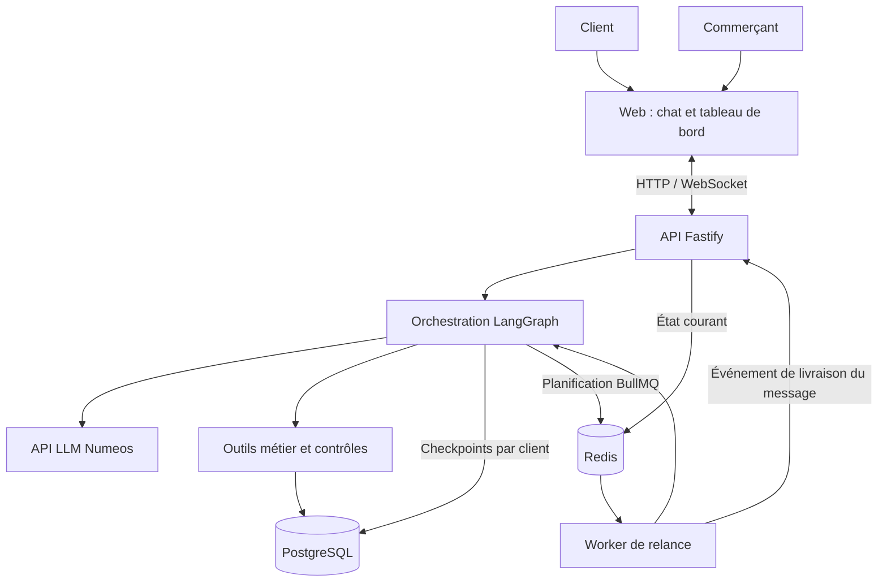

# Kenza

**De la conversation à la commande, en français, en arabe et en darija.**

Kenza est un projet d’agent commercial pour les boutiques qui vendent par messagerie. Il accompagne le client dans son choix, vérifie les disponibilités, prépare sa commande et assure le suivi de la conversation. Le commerçant garde la main sur les situations qui demandent son intervention.

Projet réalisé dans le cadre du hackathon **ESISA × Numeos Technology**, sujet 02, du 17 au 19 septembre 2026.

> **État du projet : achat, chat et supervision implémentés.** Catalogue, panier, confirmation transactionnelle, agents LangGraph, mémoire PostgreSQL et transfert humain sont présents. Le tableau de bord affiche les commandes Kenza, la conversion après échange et les transferts ; les réponses commerçant sont protégées contre les doublons. Dernière validation locale : 22 tests réussis, deux tests PostgreSQL ignorés faute de moteur Docker disponible, compilation réussie et parcours commerçant vérifié sur une base de test isolée. Relances, A/B testing, multimodal et négociation restent à réaliser. Le [journal de reprise](Docs/ETAT_DEVELOPPEMENT.md) précise les limites et le prochain jalon.

## Le besoin

Une question sur une taille, un prix ou une livraison peut décider d’une vente. Lorsqu’une boutique reçoit des centaines de messages, répondre à temps, retrouver les préférences d’un client et reprendre les paniers abandonnés devient difficile.

Kenza prend en charge ce suivi à partir des données de la boutique. Les prix, les stocks et les conditions commerciales restent la source de vérité. Lorsqu’une demande dépasse ses autorisations, l’agent transmet le dossier au commerçant avec le contexte nécessaire pour poursuivre l’échange.

## Un parcours de vente complet

Un client écrit : « Salam, kayn had modèle en bleu, taille M ? Livraison l Fès ? »

Kenza recherche les références correspondantes, consulte le stock et vérifie la livraison. Si la taille demandée est indisponible, il propose une alternative disponible. Le client peut modifier son choix, ajouter un article ou demander une remise sans perdre le contenu de son panier.

Avant validation, un récapitulatif présente les articles, les quantités, les remises autorisées et les frais de livraison. La confirmation déclenche une nouvelle vérification, puis l’enregistrement de la commande en base. Celle-ci devient visible dans le tableau de bord du commerçant.

Lors d’un prochain échange, le contexte du client permet de reprendre la conversation. Si le panier reste inachevé, une relance peut être planifiée selon les règles de la boutique.

## Fonctionnalités prévues

### Conversation et conseil

- Chat web en temps réel, utilisé comme canal principal de démonstration.
- Compréhension et réponse en français, arabe et darija, y compris les messages mêlant plusieurs langues.
- Recherche produit par caractéristiques : modèle, couleur, taille, matière et budget.
- Consultation du catalogue et du stock par des outils connectés aux données.
- Questions ciblées lorsqu’une demande est ambiguë ou incomplète.
- Mémoire par client : échanges précédents, contexte utile et historique des commandes.
- Réponses immédiates aux messages entrants, 24 h/24.
- Simulateur sans inscription : choix d’un client fictif ou création d’un profil de démonstration avec identifiant stable.

### Panier et commande

- Ajout, modification et suppression d’articles pendant la conversation.
- Calcul des prix, promotions applicables, frais de livraison et total.
- Vérification des villes desservies, des délais et des options de paiement ou de retrait.
- Confirmation explicite avant création de la commande.
- Enregistrement persistant de la commande et de ses lignes, avec mise à jour du stock.
- Protection contre les doubles commandes lors d’une confirmation répétée.

### Supervision commerçant

- Vue des conversations, de leur état et du contexte client.
- Liste et détail des commandes créées par Kenza.
- Suivi des ventes et du taux de conversion, distinct des données historiques importées.
- File d’escalade avec motif, résumé, panier et historique complet.
- Reprise humaine de la conversation, avec suspension des réponses automatiques.
- Journal des actions : outils appelés, résultats et motifs des transferts.
- Accès protégé par un compte commerçant unique.

### Relances et suivi

- Détection des paniers abandonnés et décision de relance selon le contexte.
- Planification persistante des envois dans une file de tâches.
- Échéance à 30 minutes après le dernier message du client, même la nuit ; chaque nouveau message remet le délai à zéro.
- Vérification de l’éligibilité avant envoi : panier toujours pertinent, absence de commande finalisée et de reprise humaine.
- Limitation des relances et prise en compte du refus du client.
- Une seule relance pour un même abandon ; aucune répétition automatique toutes les 30 minutes.
- Suivi des envois, réponses et commandes associées.

## Les quatre extensions retenues

| Fonctionnalité               | Comportement attendu                                                                                                                       |
| ---------------------------- | ------------------------------------------------------------------------------------------------------------------------------------------ |
| **Notes vocales**            | Transcrire un vocal, comprendre la demande et utiliser son contenu pour poursuivre la vente. Faire préciser les informations ambiguës.     |
| **Recherche par image**      | Rechercher des produits du catalogue à partir d’une photo et distinguer une correspondance probable d’un article simplement similaire.     |
| **Négociation encadrée**     | Proposer une remise autorisée, appliquer un plancher contrôlé par le code et transférer les demandes d’exception.                          |
| **A/B testing des relances** | Répartir les clients éligibles entre deux variantes, suivre leurs résultats et afficher les effectifs ainsi que les conversions observées. |

Les capacités audio et image des endpoints fournis restent à vérifier. Le périmètre visuel retenu est l’extraction des caractéristiques d’une photo pour proposer des produits similaires du catalogue, sans identification exacte ni photos de référence obligatoires. La réponse vocale de l’agent ne fait pas partie du périmètre actuel.

## Règles commerciales

Les contrôles critiques seront appliqués dans les outils métier, au moment de calculer un prix ou de créer une commande.

| Situation                                                          | Règle                                                                                                                 |
| ------------------------------------------------------------------ | --------------------------------------------------------------------------------------------------------------------- |
| Prix et promotions                                                 | Promotion valide et applicable prioritaire, sans cumul avec une remise supplémentaire.                                |
| Demande de remise                                                  | Hors promotion, proposition possible face à une hésitation du client, dans la limite de 10 % sans validation humaine. |
| Rupture de stock                                                   | Annoncer l’indisponibilité et rechercher une alternative réellement disponible.                                       |
| Réassort                                                           | Ne jamais promettre une date à partir du délai indicatif du catalogue.                                                |
| Livraison                                                          | Utiliser exclusivement les frais et délais de la grille fournie.                                                      |
| Ville absente de la grille                                         | Transférer au commerçant, sans estimer de tarif ni de délai.                                                          |
| Paiement à la livraison                                            | Le proposer uniquement dans les villes où il est autorisé.                                                            |
| Échange ou avoir                                                   | Informer sur le délai de sept jours, sous réserve d’un article non porté avec son étiquette.                          |
| Remboursement en espèces                                           | Transférer au commerçant.                                                                                             |
| Facturation société, réclamation, litige ou demande hors catalogue | Transmettre la demande avec le contexte complet.                                                                      |

Une panne d’outil ne doit jamais être présentée comme une action réussie. Une commande ne sera annoncée comme créée qu’après confirmation de son enregistrement.

## Architecture cible

L’application suivra les technologies recommandées dans le cahier des charges. Elle sera développée à partir de zéro, aucun projet d’amorçage n’étant disponible à ce stade.

| Couche                   | Technologie                     | Responsabilité                                                |
| ------------------------ | ------------------------------- | ------------------------------------------------------------- |
| Interface                | React 18, TypeScript, Vite      | Chat client et tableau de bord commerçant                     |
| API                      | Node.js 20, TypeScript, Fastify | WebSocket, endpoints et accès aux fonctions métier            |
| Orchestration            | LangGraph                       | Agents distincts, transitions d’état et reprises              |
| Persistance              | PostgreSQL 16                   | Données métier et checkpoints de la mémoire conversationnelle |
| État temporaire et files | Redis 7                         | Contexte courant et stockage des files BullMQ                 |
| Tâches de fond           | BullMQ et worker Node.js        | Exécution des relances planifiées                             |
| Modèles                  | API Numeos compatible OpenAI    | Accès aux modèles fournis, configuré côté serveur             |
| Exécution                | Docker Compose                  | Lancement des cinq services                                   |



### Responsabilités des agents

| Agent            | Responsabilité                                                                     |
| ---------------- | ---------------------------------------------------------------------------------- |
| **Conversation** | Comprendre le besoin, suivre le panier et conserver le contexte du client.         |
| **Catalogue**    | Rechercher les produits et utiliser les outils de stock, livraison et commande.    |
| **Relance**      | Décider qui relancer, quand et avec quel message.                                  |
| **Garde-fou**    | Vérifier les données et les autorisations avant les réponses ou actions sensibles. |
| **Escalade**     | Identifier les situations à transférer et préparer le dossier pour le commerçant.  |

Le graphe devra rendre leurs interventions et leurs transitions explicites. PostgreSQL conservera la mémoire durable ; Redis portera l’état temporaire et les tâches planifiées. Les relances seront exécutées par le worker, indépendamment du processus de l’API.

## Données de travail

Le jeu de données fourni par les organisateurs décrit une boutique fictive.

| Source                     | Contenu                                                         |
| -------------------------- | --------------------------------------------------------------- |
| `catalogue.csv`            | 80 références avec caractéristiques, prix et stock              |
| `clients.csv`              | 120 clients                                                     |
| `commandes.csv`            | 320 commandes historiques                                       |
| `commandes-lignes.csv`     | 449 lignes de commande                                          |
| `livraison.csv`            | 12 entrées de livraison par ville                               |
| `promotions.csv`           | 12 promotions datées                                            |
| `conversations.jsonl`      | Corpus annoncé de 40 conversations en français, arabe et darija |
| `politique-commerciale.md` | Règles de prix, de stock et d’escalade                          |
| `faq-boutique.md`          | Informations pratiques de la boutique                           |

Le cahier des charges est disponible localement dans `Docs/` et l’archive d’origine dans `Data/`. Les fichiers nécessaires à l’import sont extraits dans `Data/seed/`, sans modification de leur contenu. Les règles validées dans le plan de développement remplacent explicitement la mention de traitement différé des messages nocturnes présente dans la FAQ source.

## Installation et configuration

Le catalogue, les profils fictifs, le panier persistant et la confirmation de commande sont utilisables. Le commerçant dispose d’une connexion et d’une liste des commandes Kenza. La conversation autonome, les relances et les entrées multimodales restent en développement.

### Avec Docker

Prérequis : Docker Desktop démarré avec le moteur Linux et Docker Compose.

1. Copier `.env.example` vers `.env` et adapter les paramètres locaux. Définir `MERCHANT_EMAIL` et `MERCHANT_PASSWORD` (12 caractères minimum), ou utiliser `pnpm merchant:setup` après installation des dépendances pour générer un compte local.
2. Lancer `docker compose up --build`.
3. Ouvrir `http://localhost:8080`.

Les services prévus sont `web`, `api`, `postgres`, `redis` et `worker`. Les migrations et le premier import s’exécutent au démarrage de l’API. Un import déjà effectué ne remet pas le stock à zéro. Les données PostgreSQL et Redis sont conservées dans des volumes.

Les ports sont liés à l’interface locale. PostgreSQL est accessible depuis l’hôte sur le port `15432` (configurable avec `POSTGRES_HOST_PORT`) et reste sur `5432` dans le réseau Docker. Les identifiants PostgreSQL d’exemple sont destinés au développement local. Les capacités conversationnelles ne sont pas activées par la seule présence d’une clé LLM.

### Essayer le parcours de commande

Dans « Ouvrir la boutique », sélectionner un profil fictif ou en créer un. Chercher un article, l’ajouter au panier, choisir la ville, la réception et le paiement prévu, puis cliquer sur « Vérifier le total ». Le récapitulatif applique les promotions et les frais réels. La commande est enregistrée uniquement après « Confirmer ma commande ».

Le récapitulatif expire après dix minutes. Si le panier ou les conditions tarifaires changent, une nouvelle validation est demandée. Le stock est décrémenté dans la même transaction que la commande ; une confirmation répétée ne crée pas de doublon. Les articles ajoutés au panier ne sont pas réservés.

« Espace commerçant » utilise les identifiants de `.env`. Sans ces identifiants, l’accès reste fermé. Les sessions sont stockées dans Redis pour huit heures, avec cookies HttpOnly/SameSite, protection des écritures contre les requêtes intersites, limitation des tentatives de connexion et révocation à la déconnexion. Activer `COOKIE_SECURE=true` en cas d’exposition sous HTTPS. Les profils clients du simulateur restent volontairement partagés : ils ne constituent pas une authentification de clients réels.

Le paiement sélectionné exprime un mode de règlement prévu. Ce prototype n’encaisse rien, ne génère aucun lien bancaire et ne marque aucune commande comme payée. Les commandes historiques sont exclues de la liste commerçant actuelle.

### Développement local

Prérequis : Node.js 20.19 ou supérieur et pnpm 10.26.1. Les images applicatives utilisent Node.js 20.

```sh
pnpm install --frozen-lockfile
pnpm check
pnpm build
```

Lancer `pnpm dev:api` et `pnpm dev:web` dans deux terminaux ; l’interface se trouve à `http://localhost:5173`. Pour activer les dépendances : `docker compose up -d postgres redis`, puis `pnpm db:migrate`, `pnpm db:seed` et `pnpm dev:worker`.

Les tests SQL embarqués utilisent PGlite uniquement comme outil de test. L’application reste conçue pour PostgreSQL 16. Ces tests ne remplacent pas les vérifications réseau, de concurrence et de redémarrage sur les vrais services Docker.

Un test de concurrence PostgreSQL est activé lorsque `TEST_DATABASE_URL` est défini : `node --import tsx --test tests/checkout.test.ts`. Il crée un schéma isolé, y importe le jeu de données, vérifie l’achat concurrent du dernier article et quatre confirmations simultanées, puis supprime uniquement ce schéma de test. Le stock de la boutique est préservé. Ces scénarios ont été exécutés avec succès sur PostgreSQL 16 Docker.

Les accès fournis utilisent deux configurations distinctes :

| Accès                                  | Variables                                                                                                                              |
| -------------------------------------- | -------------------------------------------------------------------------------------------------------------------------------------- |
| GPT-5.5, endpoint compatible OpenAI v1 | `LLM_URL`, `LLM_API_KEY`, `LLM_MODEL`                                                                                                  |
| GPT-4.1, déploiement Azure             | `AZURE_OPENAI_ENDPOINT`, `AZURE_OPENAI_API_KEY`, `AZURE_OPENAI_API_VERSION`, `AZURE_OPENAI_DEPLOYMENT_NAME`, `AZURE_OPENAI_MAX_TOKENS` |
| Embeddings                             | `EMBEDDING_MODEL`, `EMBEDDING_DIMENSIONS` ; endpoint et clé principaux par défaut                                                      |

La version Azure fournie est `2024-12-01-preview`, avec une limite configurée à `16384` tokens. Ce plafond n’est pas une consommation imposée à chaque appel. Le modèle d’embeddings fourni est `embedder-small-3`, avec `512` dimensions. Des champs `EMBEDDING_URL` et `EMBEDDING_API_KEY` existent pour un éventuel accès distinct.

Le SDK officiel utilise un [client Azure spécifique](https://developers.openai.com/api/reference/typescript#microsoft-azure-openai) pour le déploiement GPT-4.1. Les anciens champs `SECONDARY_LLM_*` sont remplacés par les noms Azure ci-dessus.

Les secrets restent côté serveur, dans `.env`, exclu de Git. `.env.example` ne contient aucune clé réelle. `pnpm models:check` effectue trois requêtes de diagnostic avec du texte fictif et un budget borné, sans afficher les clés ou les réponses brutes. Ces tests réels ont réussi pour les deux modèles de dialogue et pour les embeddings de 512 dimensions. Ils ne valident pas encore les capacités audio, image, appels d’outils ni les agents commerciaux.

## Validation prévue

Les essais couvriront les huit exigences du MVP et les quatre extensions. Les scénarios prioritaires sont :

- Conversation en darija jusqu’à une commande visible dans le tableau de bord.
- Retour d’un client avec récupération du contexte précédent.
- Produit épuisé et proposition d’une alternative disponible.
- Changement de taille, de quantité ou de ville en cours de commande.
- Demande de remise excessive et tentative de contournement des règles.
- Ville non desservie et transfert avec contexte.
- Confirmation répétée sans création de doublon.
- Échec d’un outil sans fausse confirmation de commande.
- Redémarrage avec conservation de la mémoire et des relances planifiées.
- Annulation d’une relance après achat ou reprise humaine.
- Demande par vocal ou photo, avec clarification en cas d’incertitude.
- Attribution et suivi des variantes de relance.

Un délai court configurable permettra de démontrer une relance en direct, en utilisant le même mécanisme de planification que le fonctionnement normal.

## Périmètre et décisions restantes

Le simulateur web est le canal retenu. Une intégration WhatsApp réelle pourra être envisagée séparément ; elle n’est pas nécessaire pour satisfaire le MVP.

Le paiement en ligne réel, l’application mobile native, la gestion multi-boutiques, les rôles utilisateurs et la gestion complète des retours sont hors périmètre.

Le cumul, le délai, les horaires de relance et l’identité des utilisateurs ont été décidés dans le plan de développement. La formule du taux de conversion et la fenêtre d’attribution A/B seront documentées avec leur implémentation.
