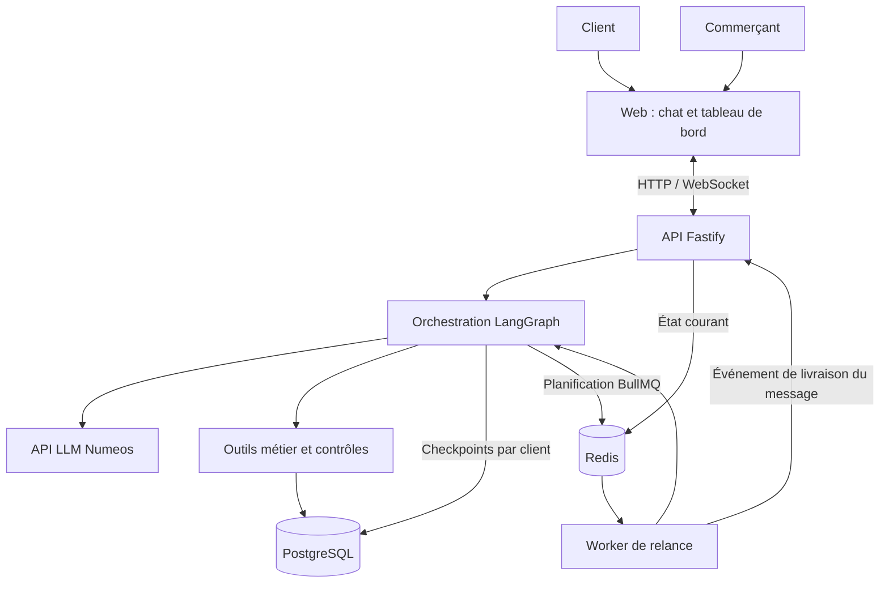

# Kenza

**De la conversation à la commande, en français, en arabe et en darija.**

Kenza est un projet d’agent commercial pour les boutiques qui vendent par messagerie. Il accompagne le client dans son choix, vérifie les disponibilités, prépare sa commande et assure le suivi de la conversation. Le commerçant garde la main sur les situations qui demandent son intervention.

Projet réalisé dans le cadre du hackathon **ESISA × Numeos Technology**, sujet 02, du 17 au 19 septembre 2026.

> **État du projet : conception.** Ce README décrit le périmètre retenu et l’architecture cible. L’application n’est pas encore implémentée ; les fonctionnalités ci-dessous constituent la feuille de route de développement.

## Le besoin

Une question sur une taille, un prix ou une livraison peut décider d’une vente. Lorsqu’une boutique reçoit des centaines de messages, répondre à temps, retrouver les préférences d’un client et reprendre les paniers abandonnés devient difficile.

Kenza prend en charge ce suivi à partir des données de la boutique. Les prix, les stocks et les conditions commerciales restent la source de vérité. Lorsqu’une demande dépasse ses autorisations, l’agent transmet le dossier au commerçant avec le contexte nécessaire pour poursuivre l’échange.

## Un parcours de vente complet

Un client écrit : « Salam, kayn had modèle en bleu, taille M ? Livraison l Fès ? »

Kenza recherche les références correspondantes, consulte le stock et vérifie la livraison. Si la taille demandée est indisponible, il propose une alternative disponible. Le client peut modifier son choix, ajouter un article ou demander une remise sans perdre le contenu de son panier.

Avant validation, un récapitulatif présente les articles, les quantités, les remises autorisées et les frais de livraison. La confirmation déclenche une nouvelle vérification, puis l’enregistrement de la commande en base. Celle-ci devient visible dans le tableau de bord du commerçant.

Lors d’un prochain échange, le contexte du client permet de reprendre la conversation. Si le panier reste inachevé, une relance peut être planifiée selon les règles de la boutique.

## Fonctionnalités prévues

### Conversation et conseil

- Chat web en temps réel, utilisé comme canal principal de démonstration.
- Compréhension et réponse en français, arabe et darija, y compris les messages mêlant plusieurs langues.
- Recherche produit par caractéristiques : modèle, couleur, taille, matière et budget.
- Consultation du catalogue et du stock par des outils connectés aux données.
- Questions ciblées lorsqu’une demande est ambiguë ou incomplète.
- Mémoire par client : échanges précédents, contexte utile et historique des commandes.

### Panier et commande

- Ajout, modification et suppression d’articles pendant la conversation.
- Calcul des prix, promotions applicables, frais de livraison et total.
- Vérification des villes desservies, des délais et des options de paiement ou de retrait.
- Confirmation explicite avant création de la commande.
- Enregistrement persistant de la commande et de ses lignes, avec mise à jour du stock.
- Protection contre les doubles commandes lors d’une confirmation répétée.

### Supervision commerçant

- Vue des conversations, de leur état et du contexte client.
- Liste et détail des commandes créées par Kenza.
- Suivi des ventes et du taux de conversion, distinct des données historiques importées.
- File d’escalade avec motif, résumé, panier et historique complet.
- Reprise humaine de la conversation, avec suspension des réponses automatiques.
- Journal des actions : outils appelés, résultats et motifs des transferts.

### Relances et suivi

- Détection des paniers abandonnés et décision de relance selon le contexte.
- Planification persistante des envois dans une file de tâches.
- Vérification de l’éligibilité avant envoi : panier toujours pertinent, absence de commande finalisée et de reprise humaine.
- Limitation des relances et prise en compte du refus du client.
- Suivi des envois, réponses et commandes associées.

## Les quatre extensions retenues

| Fonctionnalité | Comportement attendu |
| --- | --- |
| **Notes vocales** | Transcrire un vocal, comprendre la demande et utiliser son contenu pour poursuivre la vente. Faire préciser les informations ambiguës. |
| **Recherche par image** | Rechercher des produits du catalogue à partir d’une photo et distinguer une correspondance probable d’un article simplement similaire. |
| **Négociation encadrée** | Proposer une remise autorisée, appliquer un plancher contrôlé par le code et transférer les demandes d’exception. |
| **A/B testing des relances** | Répartir les clients éligibles entre deux variantes, suivre leurs résultats et afficher les effectifs ainsi que les conversions observées. |

Les capacités audio et image des endpoints fournis restent à vérifier. La précision de la recherche visuelle dépendra également des images de référence disponibles pour le catalogue. La réponse vocale de l’agent ne fait pas partie du périmètre actuel.

## Règles commerciales

Les contrôles critiques seront appliqués dans les outils métier, au moment de calculer un prix ou de créer une commande.

| Situation | Règle |
| --- | --- |
| Prix et promotions | Utiliser le catalogue et les promotions valides, avec leurs conditions d’application. |
| Demande de remise | Ne pas dépasser 10 % sans validation humaine. |
| Rupture de stock | Annoncer l’indisponibilité et rechercher une alternative réellement disponible. |
| Réassort | Ne jamais promettre une date à partir du délai indicatif du catalogue. |
| Livraison | Utiliser exclusivement les frais et délais de la grille fournie. |
| Ville absente de la grille | Transférer au commerçant, sans estimer de tarif ni de délai. |
| Paiement à la livraison | Le proposer uniquement dans les villes où il est autorisé. |
| Échange ou avoir | Informer sur le délai de sept jours, sous réserve d’un article non porté avec son étiquette. |
| Remboursement en espèces | Transférer au commerçant. |
| Facturation société, réclamation, litige ou demande hors catalogue | Transmettre la demande avec le contexte complet. |

Une panne d’outil ne doit jamais être présentée comme une action réussie. Une commande ne sera annoncée comme créée qu’après confirmation de son enregistrement.

## Architecture cible

L’application suivra les technologies recommandées dans le cahier des charges. Elle sera développée à partir de zéro, aucun projet d’amorçage n’étant disponible à ce stade.

| Couche | Technologie | Responsabilité |
| --- | --- | --- |
| Interface | React 18, TypeScript, Vite | Chat client et tableau de bord commerçant |
| API | Node.js 20, TypeScript, Fastify | WebSocket, endpoints et accès aux fonctions métier |
| Orchestration | LangGraph | Agents distincts, transitions d’état et reprises |
| Persistance | PostgreSQL 16 | Données métier et checkpoints de la mémoire conversationnelle |
| État temporaire et files | Redis 7 | Contexte courant et stockage des files BullMQ |
| Tâches de fond | BullMQ et worker Node.js | Exécution des relances planifiées |
| Modèles | API Numeos compatible OpenAI | Accès aux modèles fournis, configuré côté serveur |
| Exécution | Docker Compose | Lancement des cinq services |

### Responsabilités des agents

| Agent | Responsabilité |
| --- | --- |
| **Conversation** | Comprendre le besoin, suivre le panier et conserver le contexte du client. |
| **Catalogue** | Rechercher les produits et utiliser les outils de stock, livraison et commande. |
| **Relance** | Décider qui relancer, quand et avec quel message. |
| **Garde-fou** | Vérifier les données et les autorisations avant les réponses ou actions sensibles. |
| **Escalade** | Identifier les situations à transférer et préparer le dossier pour le commerçant. |

Le graphe devra rendre leurs interventions et leurs transitions explicites. PostgreSQL conservera la mémoire durable ; Redis portera l’état temporaire et les tâches planifiées. Les relances seront exécutées par le worker, indépendamment du processus de l’API.

## Données de travail

Le jeu de données fourni par les organisateurs décrit une boutique fictive.

| Source | Contenu |
| --- | --- |
| `catalogue.csv` | 80 références avec caractéristiques, prix et stock |
| `clients.csv` | 120 clients |
| `commandes.csv` | 320 commandes historiques |
| `commandes-lignes.csv` | 449 lignes de commande |
| `livraison.csv` | 12 entrées de livraison par ville |
| `promotions.csv` | 12 promotions datées |
| `conversations.jsonl` | Corpus annoncé de 40 conversations en français, arabe et darija |
| `politique-commerciale.md` | Règles de prix, de stock et d’escalade |
| `faq-boutique.md` | Informations pratiques de la boutique |

Le cahier des charges est disponible localement dans `Docs/` et l’archive des données dans `Data/`. Leur présence sur GitHub dépendra d’un ajout séparé ; ce premier dépôt documentaire ne les publie pas.

## Installation et configuration

**Il n’existe pas encore de version exécutable.** Les fichiers Docker, les dépendances et les instructions d’installation seront ajoutés avec le socle applicatif.

La cible est un lancement par `docker compose up`, après configuration, avec cinq services : `web`, `api`, `postgres` et `redis`, ainsi qu’un `worker` dédié aux tâches de fond.

L’accès aux modèles reposera sur les paramètres fournis par les organisateurs : `LLM_URL`, `LLM_API_KEY` et l’identifiant exact du modèle. Les accès GPT-5.5 et GPT-4.1 seront testés avant de fixer leur répartition entre les tâches.

Les secrets resteront côté serveur, dans une configuration locale exclue de Git. Le futur `.env.example` documentera les variables nécessaires sans contenir de clé réelle.

## Validation prévue

Les essais couvriront les huit exigences du MVP et les quatre extensions. Les scénarios prioritaires sont :

- Conversation en darija jusqu’à une commande visible dans le tableau de bord.
- Retour d’un client avec récupération du contexte précédent.
- Produit épuisé et proposition d’une alternative disponible.
- Changement de taille, de quantité ou de ville en cours de commande.
- Demande de remise excessive et tentative de contournement des règles.
- Ville non desservie et transfert avec contexte.
- Confirmation répétée sans création de doublon.
- Échec d’un outil sans fausse confirmation de commande.
- Redémarrage avec conservation de la mémoire et des relances planifiées.
- Annulation d’une relance après achat ou reprise humaine.
- Demande par vocal ou photo, avec clarification en cas d’incertitude.
- Attribution et suivi des variantes de relance.

Un délai court configurable permettra de démontrer une relance en direct, en utilisant le même mécanisme de planification que le fonctionnement normal.

## Périmètre et décisions restantes

Le simulateur web est le canal retenu. Une intégration WhatsApp réelle pourra être envisagée séparément ; elle n’est pas nécessaire pour satisfaire le MVP.

Le paiement en ligne réel, l’application mobile native, la gestion multi-boutiques, les rôles utilisateurs et la gestion complète des retours sont hors périmètre.

Avant leur implémentation, les règles suivantes devront être fixées : cumul des promotions et remises, délai d’abandon, horaires et fréquence des relances, formule du taux de conversion et identification des clients dans le simulateur. Les choix retenus seront documentés avec leur mise en œuvre.
